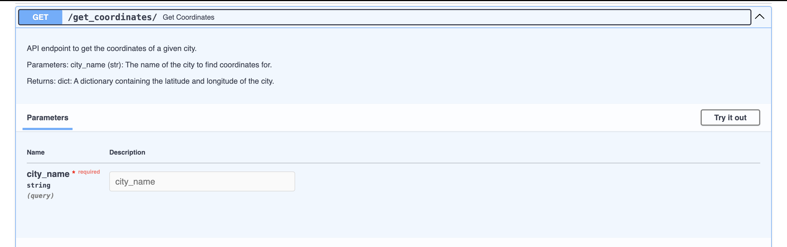

# TaskApi

## Descripcion

Api creado como un mini proyecto para el curso de Ingenieria de Software. La api nos ayuda a entender el funcionamiento de TDD y como se puede implementar en un proyecto.

A su vez tambien aprendimos sobre el uso de Docker,FastApi y como se puede implementar en un proyecto.

## Instalacion

Para instalar el proyecto se debe clonar el repositorio y luego ejecutar el siguiente comando:

```bash
git clone https://github.com/Jerimy2021/TaskApi.git
```

Luego se debe ejecutar el siguiente comando para instalar las dependencias:

```bash
source task/bin/activate
cd  app
pip install -r requirements.txt
```

Una vez instalada las dependencias podemos avanzar a la siguiente seccion.

## Uso

Para ver la parte de mi implementacion de TDD en el proyecto se debe ejecutar el siguiente comando:

```bash
cd app

pytest test_structural.py
```

Los resultados que debemos tener es que todos los test pasen.

Imagen de los test pasados:


Al ejecutar esto me percate de la funcionalidad de como iba cambiando el codigo y como se iba implementando en el proyecto.
en el archivo test_structural.py y la mejora constante en el archivo "example.py" (app). Por otro lado tambien se implemento el uso de pytest-cov para ver la cobertura de los test.

Imagen resultado de la cobertura de los test:


Obteniendo un 100% de cobertura en los test.

Por otro lado medimos el stress test de la api con el siguiente comando:

```bash
locust -f locustfile.py
```

Imagen de los resultados del stress test:


Con esto se puede ver que la api soporta un gran numero de usuarios sin problemas, sin embargo se puede mejorar la api para que soporte mas usuarios, ya que en el test se puede ver que la api tiene fallos.

A medida que avanzaba comente el codigo en example.py como se puede verificar y use fastapi para la creacion de la api y consultas y la generacion de documentacion de la api.

La implementacion de fastapi se puede ver en el archivo "example.py" (app), ejecutamos el documento con el siguiente comando:

```bash
fastapi dev example.py
```

Imagen de la documentacion de la api:





Tambien implemente el CODEOWNERS para que se pueda revisar el profesor del curso es dueño de la carpeta app y pueda revisar los cambios que se hagan en el proyecto.


## Generar Documentacion

Use la libreria sphinx para generar la documentacion del proyecto, esta parte fue algo complicada pero se logro ejecutar el siguiente comando para generar el html de la documentacion:

```bash
make html
```

Una vez ejecutado el comando se debe ir a la carpeta "docs" y abrir el archivo "index.html" para ver la documentacion del proyecto y lo vez en tu browser.


## Docker

Para ejecutar el proyecto con docker se debe ejecutar el siguiente comando:

```bash

docker build -t miniproject .

docker run -d --name miniproject -p 8000:8000 miniproject_app

docker ps -a
```

Con esto se puede ver que el proyecto esta corriendo en el puerto 8000 y se puede ver en el browser.


